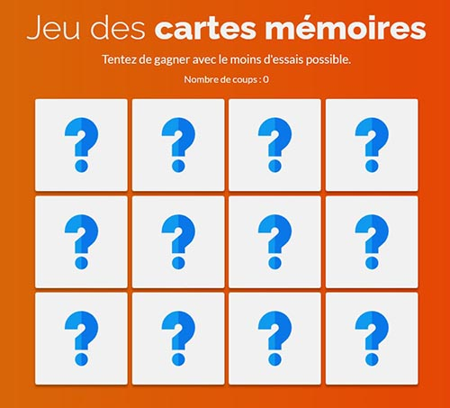
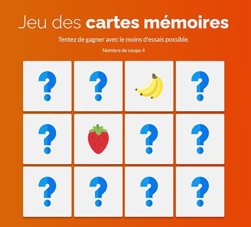
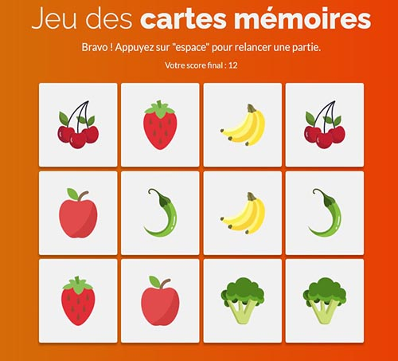

# Jeu des cartes mémoires
Autoriser: 
   
  
Vous devez coder le fameux jeu des cartes mémoires. 
Le but est de pouvoir cliquer sur les cartes afin d'apercevoir l'icône qu'elles contiennent, puis de retrouver les paires. 
Le score représente le nombre de coups tentés.
 
### A. Dans un premier temps, vous devez coder une interface basique
> Codez d'abord une interface très simple, contenant les éléments importants : boutons, inputs, liens, etc... 
> Rajoutez un peu de style si besoin est.
>  
> Puis codez les fonctionnalités JavaScript.
 

### B. Fonctionnalités JavaScript à coder pour ce projet
1. Placez les cartes dans un ordre aléatoire à chaque fois qu'on arrive sur la page.
2. On doit pouvoir cliquer sur deux cartes qui devront se retourner. Lorsque les deux cartes son visibles, elles se retournent au bout de 1,5 seconde si elles ne correspondent pas à une paire.
3. Laissez les cartes visibles lorsqu'elles correspondent à une paire.
4. Incrémentez le score en fonction du nombre d'essais.
5. Lorsque toutes les paires sont trouvées, c'est gagné, proposez de recommencer la partie en appuyant sur "espace".

 

### C. Ajoutez du style à l'interface afin de terminer le projet.

 

